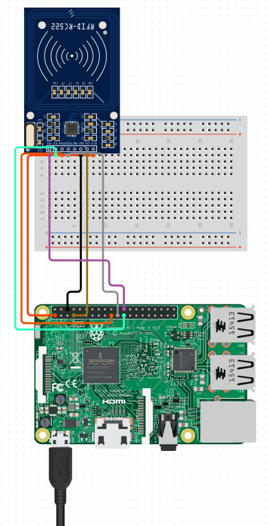
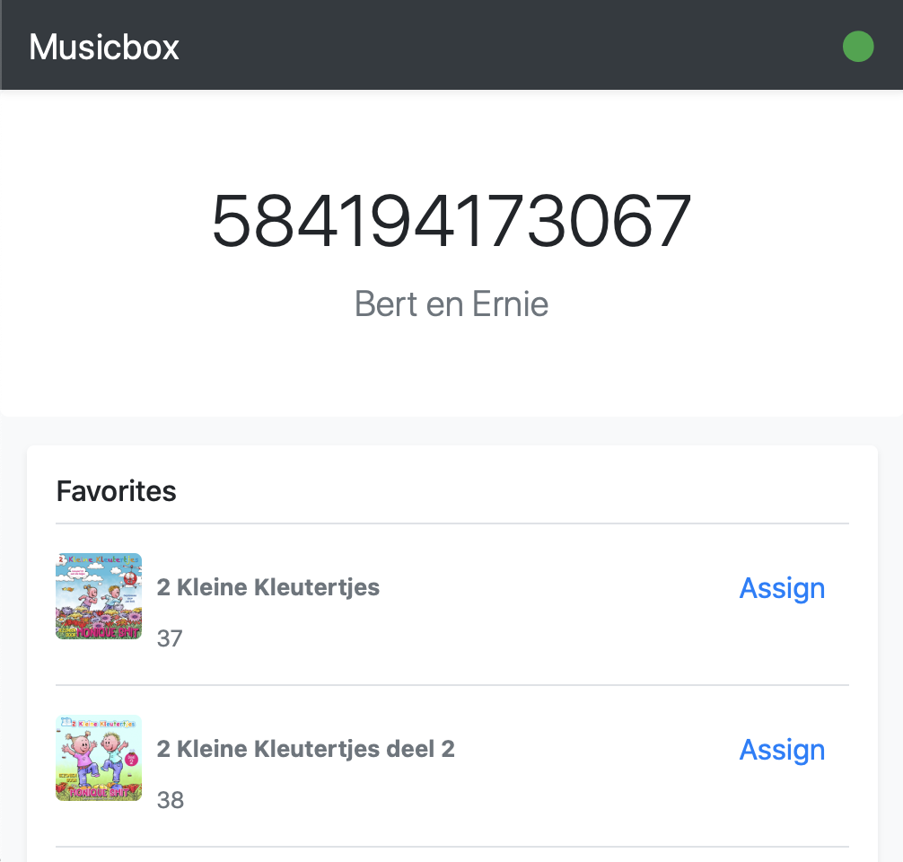

# Musicbox

A fun project to do with kids! Reads RFID tags, and plays associated music on a SONOS system.


## Hardware

### Receiver

Musicbox requires a MRFC-522 module (± €5) connected to any Raspberry Pi (with a network connection).

[Instructions](https://pimylifeup.com/raspberry-pi-rfid-rc522/)




### Tokens

You can find very cheap NTAG 213 stickers that will work decent with the MRFC-522 module.

We stick them on a 9x12,7 cm piece of paper with a nice drawing.


## Web Interface

A web interface allows you to assign RFID tags to SONOS favorites and playlists.




## Setup

After you have connected the MRFC-522 module to the Raspberry Pi, we setup the Musicbox!

### Raspbian

First, have a headless Raspbian on your Pi (WiFi configured and SSH enabled).

- [Installing Raspbian](https://www.raspberrypi.org/documentation/installation/installing-images/README.md)
- [Configure Wifi & SSH](https://www.raspberrypi.org/documentation/configuration/wireless/headless.md)

> Please change the default password for the `pi` user!

### Enable SPI

Please use `raspi-config` to enable SPI:

```sh
sudo raspi-config
```

- Select: 5 Interfacing Options
- Select: P4 SPI
- Enable!

```sh
sudo reboot
```


### Dependencies

Install required packages:

```sh
sudo apt-get update
sudo apt-get upgrade
sudo apt-get install \
    python3-dev \
    python3-pip \
    git

git clone https://github.com/tader/musicbox
cd musicbox
sudo pip3 install -r musicbox/requirements.txt
```


### Configure SONOS CLI

Setup a SONOS developer account and a new integration. [Instructions](https://github.com/bwilczynski/sonos-cli)

Then:

```sh
sonos login
sonos set household
sonos set group
```